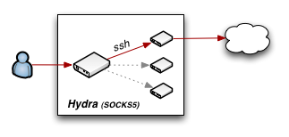

# Hydra5: load-balanced (multi-headed) SOCKS5 proxy

Given a list of hosts hydra5 opens a pool of SOCKS5 tunnels and routes incoming requests via a random tunnel. In effect, hydra5 is a regular SOCKS5 proxy, except that each outbound request is automatically load-balanced.



Hydra uses SSH to establish the SOCKS5 tunnels and [em-proxy](https://github.com/igrigorik/em-proxy) to provide the transparent routing for any SOCKS5 compatible client.

## Getting started

```
$> gem install hydra5
$> hydra --listen 8080 --hosts host1,host2 --key ssh_key.pub --user name --verbose
```

```ruby
c = Curl::Easy.new('http://jsonip.com')
c.proxy_url = 'localhost:8080'
c.proxy_type = Curl::CURLPROXY_SOCKS5

c.perform
c.body_str # => => {"ip":"72.52.131.237"}

c.perform
c.body_str # => => {"ip":"34.22.124.45"}
```

Of course, you can also convert hydra5 into a proper HTTP proxy by deploying [privoxy](http://www.privoxy.org/) or an equivalent tool in front.

## License

The MIT License - Copyright (c) 2011 Ilya Grigorik